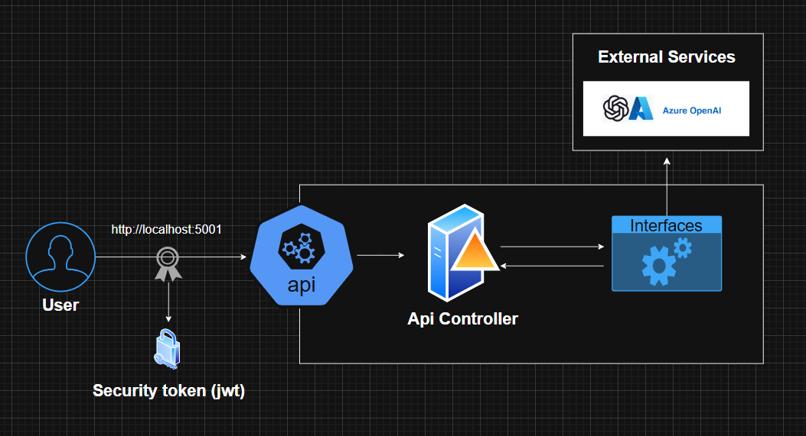

# OpenAi.Api (Azure OpenAI)
API ASP.NET Core que expone un endpoint de chat y llama a **Azure OpenAI** mediante el SDK [`Azure.AI.OpenAI`](https://www.nuget.org/packages/Azure.AI.OpenAI). Basada en el template **Template.Api.Net9** (evolucionada a .NET 10 en el proyecto).

## Requisitos
- [.NET SDK 10](https://dotnet.microsoft.com/download) (coincide con `TargetFramework` en `OpenAi.Api.csproj`)
- Cuenta de Azure Open AI con un despliegue (deployment) de modelo de chat

> **Docker:** el `Dockerfile` usa imágenes `dotnet/sdk:9.0` y `dotnet/aspnet:9.0`. Si publicas con `net10.0`, conviene alinear las imágenes a la versión 10 para evitar errores de compilación o runtime.

## Configuración
### Azure OpenAI
La sección `OpenAISetting` enlaza endpoint, deployment y clave:

```json
"OpenAISetting": {
  "Endpoint": "https://TU-RECURSO.openai.azure.com/",
  "DeploymentName": "nombre-del-deployment",
  "ApiKey": "TU_CLAVE"
}
```

En desarrollo, usa **User Secrets** o variables de entorno para no commitear claves:

```bash
dotnet user-secrets set "OpenAISetting:Endpoint" "https://..."
dotnet user-secrets set "OpenAISetting:DeploymentName" "..."
dotnet user-secrets set "OpenAISetting:ApiKey" "..."
```

### JWT (Auth0 / emisores propios)

En `Program.cs` están registrados dos esquemas JWT con nombre: `Auth0App1` y `Auth0App2` (issuer y audience desde configuración o variables de entorno con el mismo nombre jerárquico, por ejemplo `Auth0App1__Issuer`).

Ejemplo en `appsettings.*.json`:

```json
"Auth0App1": {
  "Issuer": "https://tu-dominio.auth0.com/",
  "Audience": "tu-api-audience"
},
"Auth0App2": {
  "Issuer": "https://otro-emisor/",
  "Audience": "otra-audience"
}
```

Para exigir token en un controlador o acción, usa el atributo `[Authorize]` y el esquema que corresponda, por ejemplo:

```csharp
[Authorize(AuthenticationSchemes = "Auth0App1")]
```

Hoy el `ChatController` no aplica `[Authorize]`; la autenticación está registrada a nivel de aplicación para cuando quieras proteger rutas concretas.

### CORS
Política por defecto que permite origen `http://localhost:8000` (cualquier método y cabecera). Ajusta en `Program.cs` si tu front corre en otro host.

## API
### Chat

| Método | Ruta | Cuerpo |
|--------|------|--------|
| `POST` | `/api/v1/Chat` | `{ "message": "tu pregunta" }` |

Respuesta exitosa (`200`): `{ "reply": "texto generado" }`. Si el servicio no devuelve contenido, la API responde `404`.

### Swagger
Con `ASPNETCORE_ENVIRONMENT=Development`, Swagger UI está activo. URLs típicas al ejecutar con el perfil del proyecto:

- HTTP: `http://localhost:5142/swagger`
- HTTPS: `https://localhost:7137/swagger`

## Diagrama
Arquitectura o flujo de la API (si el archivo está en el repo):



## Ejecución local
```bash
dotnet restore
dotnet build
dotnet run --project OpenAi.Api.csproj
```

Abre Swagger en la URL que indique la consola (según `Properties/launchSettings.json`).

## Docker
```bash
docker build -f Dockerfile -t openai-api .
docker run -d -p 8787:80 -e ASPNETCORE_ENVIRONMENT=Development --name openai-api openai-api
```

Swagger (solo en Development): `http://localhost:8787/swagger/index.html`

Pasa configuración sensible con `-e` o un archivo de entorno; no incluyas claves en la imagen.

## Estructura relevante
| Carpeta / archivo | Rol |
|-------------------|-----|
| `Controllers/ChatController.cs` | Endpoint REST de chat |
| `Services/Implementations/OpenAIService.cs` | Cliente Azure OpenAI y completado de chat |
| `Services/Entities/OpenAISetting.cs` | Opciones fuertemente tipadas para OpenAI |
| `Program.cs` | Pipeline, CORS, JWT, Swagger, DI |

## Licencia y origen
Agustina Fassina